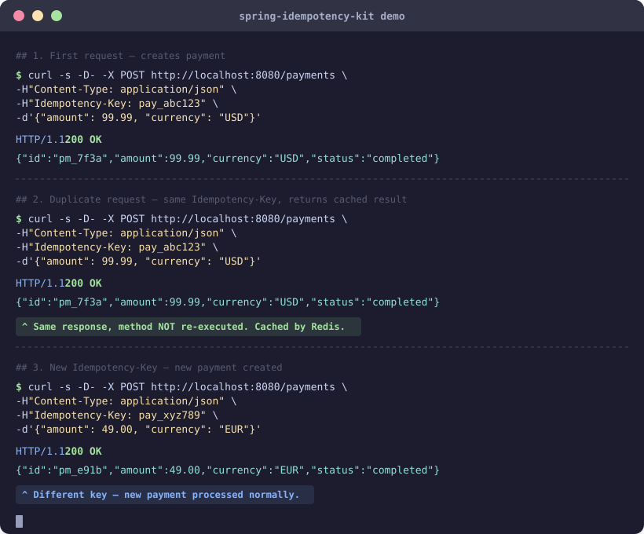
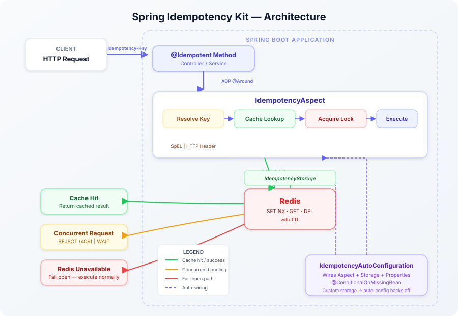

# Spring Idempotency Kit

A lightweight, production-ready idempotency solution for Spring Boot 3.x applications.

Prevents duplicate operations in distributed systems — double payments, repeated API calls, message retries, webhook duplication — by ensuring methods execute **exactly once** for a given key.

<p align="center">
  
</p>

## Features

- **Annotation-driven** — add `@Idempotent` to any Spring-managed method
- **Dual key resolution** — SpEL expressions or HTTP headers
- **Redis-backed** with distributed locking via `SET NX`
- **Concurrent request handling** — configurable REJECT (409) or WAIT (with exponential backoff) strategy
- **Failure strategies** — FAIL_OPEN (default) continues without idempotency on Redis outage, FAIL_CLOSED rejects requests
- **Response caching** — repeated calls return the cached result without re-execution
- **Configurable TTL** — per-method or global defaults
- **Micrometer metrics** — cache hits/misses, lock acquisition, execution timing, fail-open events
- **Auto-configuration** — zero boilerplate setup with Spring Boot

## Requirements

- Java 21+
- Spring Boot 3.4+
- Redis

## Quick Start

### 1. Add the dependency

```kotlin
// build.gradle.kts
dependencies {
    implementation("io.github.atlancia-labs:spring-idempotency-kit:0.1.0")
}
```

### 2. Configure Redis

```yaml
spring:
  data:
    redis:
      host: localhost
      port: 6379
```

### 3. Annotate your methods

**SpEL-based key** — extract from method arguments:

```java
@Idempotent(key = "#request.id")
public PaymentResponse processPayment(PaymentRequest request) {
    // executed once per unique request.id
}
```

**Header-based key** — extract from HTTP header:

```java
@Idempotent(headerName = "Idempotency-Key")
public OrderResponse createOrder(OrderRequest request) {
    // executed once per unique Idempotency-Key header value
}
```

## How It Works

1. The idempotency key is resolved (SpEL expression or HTTP header)
2. If a cached result exists for the key — return it immediately
3. If no cache — acquire a distributed lock via Redis `SET NX`
4. Execute the method, serialize the result, store it with TTL
5. Release the lock
6. If the method throws an exception — release the lock, **do not cache** (allows retries)

## Concurrent Request Handling

When a second request arrives while the first is still executing:

| Strategy | Behavior |
|----------|----------|
| `REJECT` (default) | Immediately throws `IdempotencyConflictException` → **409 Conflict** |
| `WAIT` | Polls Redis with exponential backoff (100ms → 1s) until the first request completes, then returns the cached result. Throws 409 on timeout. |

```java
@Idempotent(headerName = "Idempotency-Key", onConcurrent = ConcurrentStrategy.WAIT)
public Response slowOperation(Request request) {
    // second concurrent request will wait for this to finish
}
```

## Configuration

All properties are optional with sensible defaults:

```yaml
spring:
  idempotency:
    default-ttl: 24                        # TTL value (default: 24)
    default-time-unit: hours               # TTL unit (default: hours)
    default-on-concurrent: reject          # REJECT or WAIT (default: reject)
    default-on-failure: fail-open          # FAIL_OPEN or FAIL_CLOSED (default: fail-open)
    key-prefix: "idempotency:"             # Redis key prefix (default: "idempotency:")
    lock-timeout: 30s                      # Distributed lock TTL (default: 30s)
    wait-timeout: 10s                      # Max wait time for WAIT strategy (default: 10s)
    wait-poll-initial-interval: 100ms      # Initial poll interval (default: 100ms)
    wait-poll-max-interval: 1s             # Max poll interval after backoff (default: 1s)
```

Per-method overrides via annotation:

```java
@Idempotent(key = "#id", ttl = 1, timeUnit = TimeUnit.MINUTES)
public Response shortLivedOperation(String id) { ... }

@Idempotent(key = "#id", onFailure = FailureStrategy.FAIL_CLOSED)
public Response criticalPayment(String id) { ... }
```

## Error Handling

| Scenario | Behavior |
|----------|----------|
| Key resolves to `null` | `IdempotencyKeyException` → **400 Bad Request** |
| Missing HTTP header | `IdempotencyKeyException` → **400 Bad Request** |
| Both `key` and `headerName` set (or neither) | `IdempotencyConfigurationException` at invocation |
| Concurrent duplicate (REJECT) | `IdempotencyConflictException` → **409 Conflict** |
| Concurrent duplicate (WAIT, timeout) | `IdempotencyConflictException` → **409 Conflict** |
| Method throws exception | Lock released, result **not cached**, exception propagates |
| Redis unavailable (FAIL_OPEN) | Method executes normally without idempotency, warning logged |
| Redis unavailable (FAIL_CLOSED) | `IdempotencyStorageException` → **503 Service Unavailable** |

Error responses use RFC 7807 Problem Detail format via `@RestControllerAdvice`.

## Customization

### Custom storage backend

Implement `IdempotencyStorage` and register it as a bean — the auto-configuration will back off:

```java
@Bean
public IdempotencyStorage customStorage() {
    return new MyIdempotencyStorage();
}
```

```java
public interface IdempotencyStorage {
    Optional<IdempotencyResult> get(String key);
    String acquireLock(String key, Duration lockTtl);  // returns lock token, or null if already held
    void store(String key, IdempotencyResult result, Duration ttl);
    void releaseLock(String key, String lockToken);     // token-aware release
}
```

## Metrics

When Micrometer is on the classpath, the following metrics are recorded automatically:

| Metric | Type | Description |
|--------|------|-------------|
| `idempotency.cache.hit` | Counter | Cached result returned |
| `idempotency.cache.miss` | Counter | No cached result, method executed |
| `idempotency.lock.acquired` | Counter | Distributed lock acquired |
| `idempotency.lock.rejected` | Counter | Lock already held by another request |
| `idempotency.execution` | Timer | Method execution duration |
| `idempotency.failopen` | Counter | Fail-open fallback triggered (tagged by `phase`) |
| `idempotency.conflict` | Counter | Conflict response returned (tagged by `strategy`) |

## Architecture

<p align="center">
  
</p>

## License
Apache-2.0

---

Built by [Atlancia Labs](https://www.linkedin.com/company/atlancia-labs) — Senior Backend & DevOps consulting, remote.
